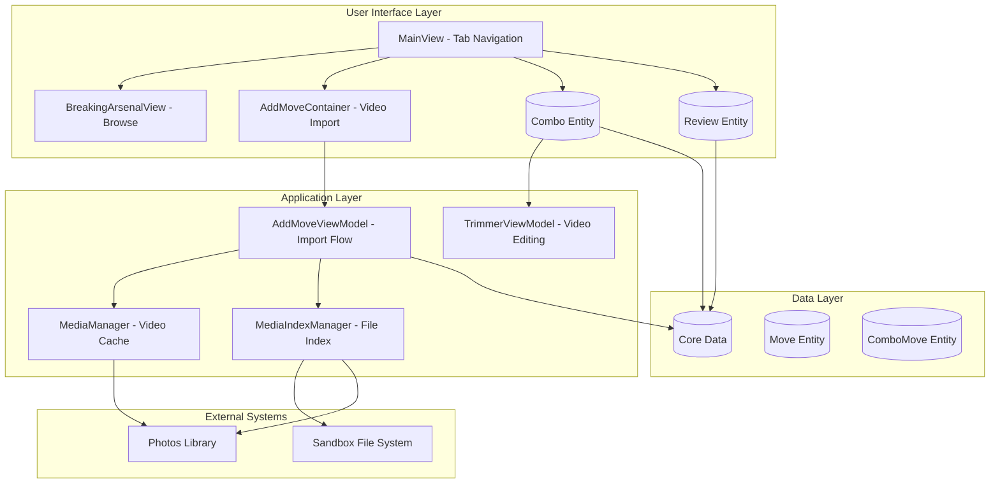
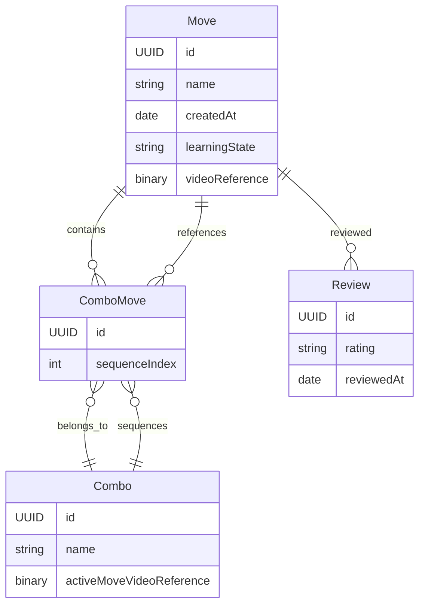
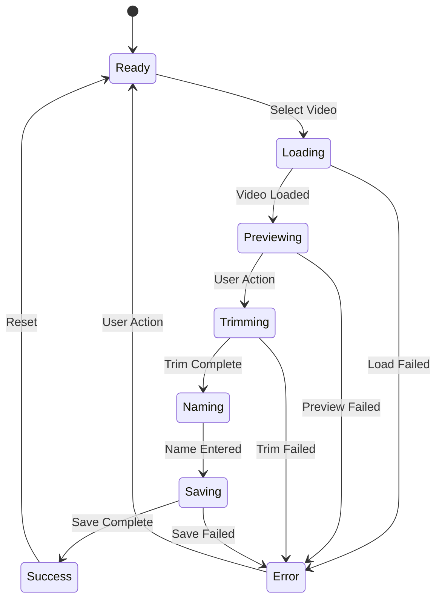
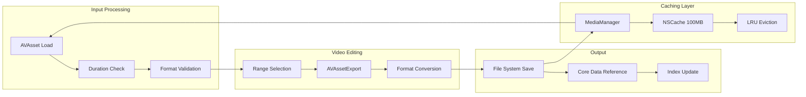
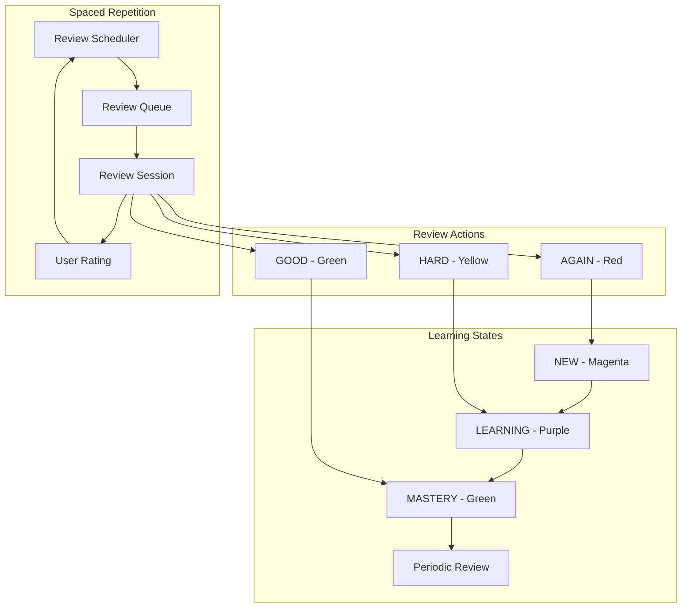
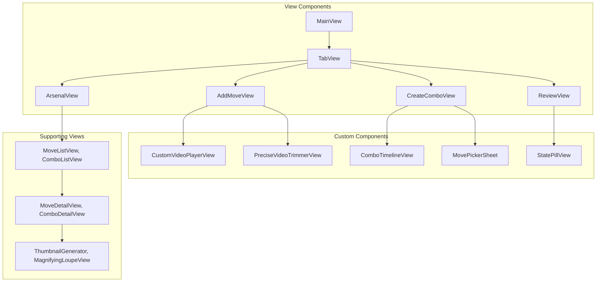
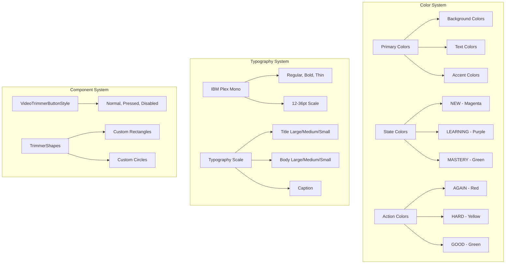
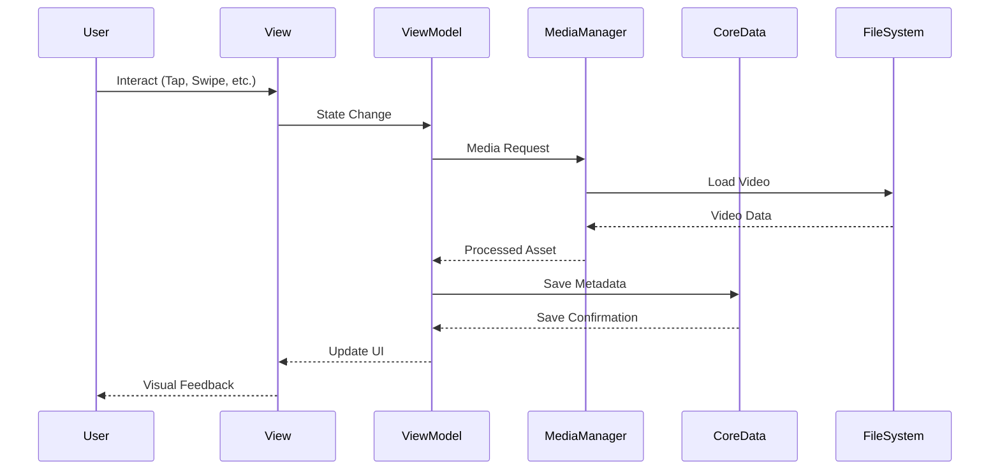

# BreakingFlashcards Architecture Overview

## First Principles Analysis

**Core Purpose**: BreakingFlashcards is a specialized learning management system for breakdancing moves, designed around video-based instruction and spaced repetition learning.

**Fundamental Components**:
1. **Video-First Learning**: Every move is represented by video content
2. **Structured Learning Path**: Moves → Combos → Reviews (spaced repetition)
3. **Mobile-First Design**: Optimized for iOS with Photos integration
4. **Performance-Conscious**: Efficient video caching and background processing

---

## High-Level System Architecture



---

## Core Data Model



### Key Relationships
- **Move ↔ ComboMove**: Many-to-many through junction table
- **Move ↔ Review**: One-to-many (learning progress tracking)
- **Combo → ComboMove**: One-to-many (ordered sequence)

---

## Media Management Architecture

```mermaid
graph TB
    subgraph "Media Pipeline"
        PhotosPicker[Photos Picker] --> Load[Load Video]
        Load --> Cache[MediaManager Cache]
        Cache --> Trim[Video Trimmer]
        Trim --> Process[Process & Save]
        Process --> Index[MediaIndexManager]
    end

    subgraph "Storage Strategy"
        Sandbox[App Sandbox] --> MovesDir[/Moves/ Directory]
        Sandbox --> IndexFile[media_index.json]
        MovesDir --> VideoFiles[UUID.mp4 Files]
    end

    subgraph "Indexing System"
        IndexFile --> Entry1[MediaIndexEntry]
        IndexFile --> Entry2[MediaIndexEntry]
        Entry1 --> Metadata[SHA256, Duration, Size]
        Entry2 --> PhotosID[Photos Local Identifier]
    end

    Load --> Sandbox
    Process --> MovesDir
    Index --> IndexFile
```

### Media Flow
1. **Import**: Photos → Temporary → Sandbox
2. **Processing**: Trim → Convert → Cache
3. **Indexing**: Metadata extraction → JSON index
4. **Recovery**: Photos rehydration for missing files

---

## Application State Flow



### AddMoveViewModel States
- **Ready**: Initial state, waiting for user input
- **Loading**: Video import from Photos library
- **Previewing**: Video loaded and ready for trimming
- **Trimming**: User adjusting video boundaries
- **Naming**: Video processed, waiting for move name
- **Saving**: Persisting to Core Data and filesystem
- **Success/Error**: Final states with feedback

---

## Video Processing Pipeline



### Performance Optimizations
- **Caching**: 100MB LRU cache for AVAssets
- **Background Processing**: Async video operations
- **Progressive Loading**: Status updates during import
- **Lazy Loading**: On-demand asset loading

---

## Learning System Design



### Learning Flow
1. **New Moves**: Start as "NEW" state
2. **Review Sessions**: User rates difficulty (AGAIN/HARD/GOOD)
3. **State Transitions**: Based on performance
4. **Spaced Repetition**: Algorithm determines next review timing

---

## Component Architecture



---

## Design System Architecture



### Design Principles
- **Dark Theme First**: Optimized for low-light practice environments
- **High Contrast**: Clear visual hierarchy for video-focused interface
- **Monochrome Typography**: IBM Plex Mono for consistent, technical feel
- **State-Based Colors**: Color coding for learning progress and actions

---

## Data Flow Patterns



### Key Patterns
1. **Reactive State**: Combine publishers for async operations
2. **Environment Injection**: Core Data context passed via SwiftUI
3. **Shared Singletons**: MediaManager, MediaIndexManager for global state
4. **MVVM Architecture**: Clear separation of View-ViewModel concerns

---

## Performance Considerations

### Memory Management
- **Asset Caching**: 100MB LRU cache with AVAsset objects
- **Background Cleanup**: Automatic temp file cleanup
- **Lazy Loading**: On-demand video loading and processing

### Storage Strategy
- **Sandbox Organization**: Dedicated `/Moves/` directory for videos
- **Index File**: JSON-based metadata for fast lookups
- **Photos Integration**: Backup recovery mechanism for lost files

### UI Responsiveness
- **Async Processing**: Non-blocking video operations
- **Progressive Loading**: Status updates during long operations
- **Optimized Rendering**: Efficient SwiftUI view updates

---

## Future Extensibility

### Potential Enhancements
1. **Cloud Sync**: iCloud integration for cross-device sync
2. **Social Features**: Share combos with community
3. **Advanced Analytics**: Learning progress visualization
4. **Offline Mode**: Download content for offline practice
5. **Multi-Format Support**: GIF, WebM video formats

### Architecture Strengths
- **Modular Design**: Clear separation of concerns
- **Scalable Data Model**: Flexible entity relationships
- **Performance Optimized**: Efficient caching and processing
- **User-Centric**: Video-first learning experience
- **Maintainable**: Clean MVVM architecture with single responsibilities

This architecture successfully balances complexity management with powerful features, creating a robust foundation for a breakdancing learning platform.
