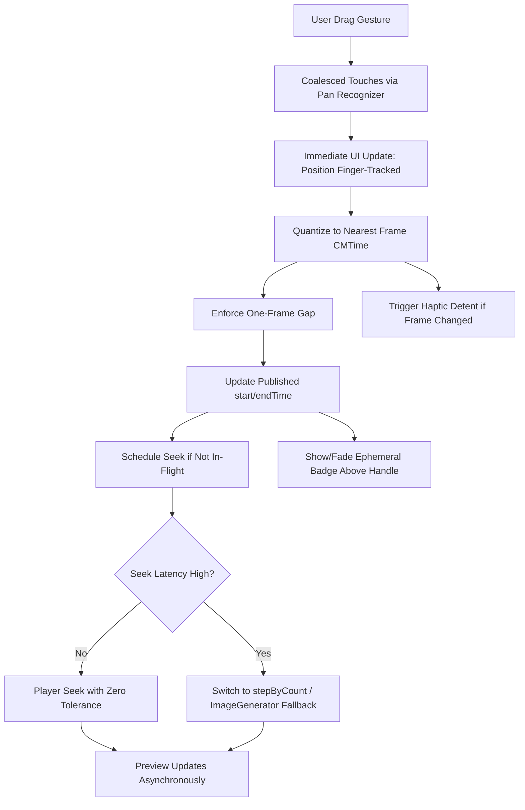

# Trimmer Enhancement Plan

## Review Summary
The PRD specification is precise, simple, highly functional, and free of UI/UX logical fallacies. Key strengths:
- **Precision**: Decouples input from seeking, uses frame-exact CMTime snapping, enforces one-frame gap, implements seek scheduler with tolerances and fallbacks.
- **Simplicity**: Minimal UI (thin track, large handles with 44pt hits, no thumbnails/gray bar, black background, native buttons).
- **Functionality**: High-fidelity tracking, velocity/vertical precision scaling, haptics per detent, async preview updates.
- **No Fallacies**: Clear contracts (inputs/outputs/events), edge cases (VFR/short clips/interrupts), risks mitigated (seek thrash), accessibility (VoiceOver, contrast).

Current code gaps: Spring animations on drag state, immediate seeks (no full single-flight), fixed badges (no fade), zoom complexity, partial haptics. Demo has unused thumbnails.

## Todo List
- [x] Review PRD content against code implementation to identify gaps in precision, simplicity, functionality, and UX logic
- [-] Implement input bridge for high-fidelity tracking with coalesced touches (T1: Use UIKit pan recognizer via representable)
- [ ] Add deterministic frame quantization and one-frame gap enforcement (T2: Snap to CMTime at 600 timescale or asset-specific)
- [ ] Develop seek scheduler with single-flight queuing and tolerance strategies (T3: Zero/zero for steppable items, fallback to stepByCount/image generator if latency high)
- [ ] Integrate haptics for frame detents and debounce (T5: Light tick per snapped frame change)
- [ ] Remove implicit animations from drag-driven state (T6: No springs on positions/handles, only opacity for badges)
- [ ] Polish visuals: Ensure black bg, no gray, native buttons, 44pt hit zones, ephemeral fading badges (T7)
- [ ] Conduct QA on edge cases: CFR/VFR, short clips, interruptions (T8)
- [ ] Update export to use snapped CMTime exactly
- [ ] Add accessibility: VoiceOver labels for times, contrast checks
- [ ] Test and validate no lag: Decouple UI updates from seeks fully

## Interaction Flow Diagram

## Next Steps
Review this plan. Upon approval, switch to code mode for implementation.