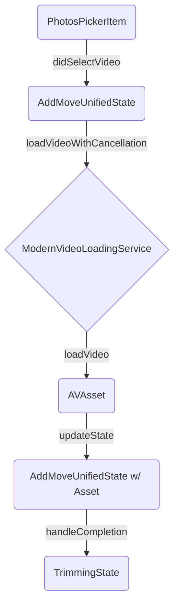
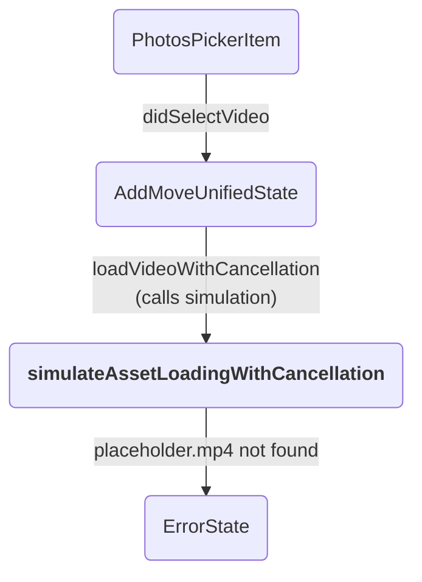

ANALYSIS 1:

Of course. The loading failure is caused by the application executing a hardcoded **simulation code path** instead of the actual video loading logic. This simulation fails because it cannot find a bundled placeholder video file (`placeholder.mp4`), leading to a critical error that terminates the process and displays the "failed loading" message.

The system's resilience architecture correctly resets the state for a new selection, but then directs the workflow into this broken simulation instead of the production video loader.

Here's a detailed breakdown and a robust implementation plan to resolve the issue.

-----

## 1\. Categorical Systems Analysis: Modeling the Failure

To understand the failure from first principles, we'll model your system using category theory.

  * **Objects (Components & Data):** `AddMoveUnifiedState`, `PhotosPickerItem`, `AVAsset`, `ModernVideoLoadingService`, `UnifiedProgressEngine`, `ErrorState`, `TrimmingState`.
  * **Morphisms (Functions & Data Flow):** A function call that transforms one object to another (e.g., loading an `AVAsset` from a `PhotosPickerItem`).

#### Ideal System (Commutative Diagram)

In a correctly functioning system, the composition of morphisms (function calls) is **commutative**—the path taken leads to the expected outcome.



*Description:* The selection of a `PhotosPickerItem` triggers a chain of operations that deterministically results in the `TrimmingState`.

#### Observed (Buggy) System: A Non-Commutative Diagram

Your logs reveal that a different, incorrect morphism is being substituted, breaking the chain.

  * **`loadVideo` (Ideal Morphism):** `PhotosPickerItem` → `AVAsset`
  * **`simulateLoad` (Observed Morphism):** `PhotosPickerItem` → `ErrorState`

The system executes the following path:



The diagram fails to commute because the `simulateAssetLoadingWithCancellation` morphism has a fatal precondition (requiring a missing file) that leads directly to the `ErrorState`, completely bypassing the transition to `TrimmingState`.

  * **Functorial Mapping:** We can define a functor `F` from the `IdealSystem` to the `ObservedSystem`. This functor incorrectly maps the `loadVideo` morphism to the `simulateLoad` morphism. The fix requires a **natural transformation** `η` that maps the output of the incorrect `F` functor back to the correct path, which in practice means replacing the function call.

-----

## 2\. Chain-of-Thought Log & Code Analysis

Tracing the execution flow through the provided logs (`11.logs.md`) reveals the precise point of failure.

1.  **Selection & Reset (Success):**

      * `[13:51:56]` `🎯 RESILIENT_LOADING: 🚀 VIDEO_SELECTION_START [1FC2BF97]`
      * The system correctly identifies a video selection and begins the "resilient loading" process. It performs an `ATOMIC_RESET`, successfully clearing the state and preparing for a new operation. The logs confirm `RACE_CONDITION_VERIFICATION` passes, ensuring no stale UI data from a previous load will appear.

2.  **State Transition to Loading (Success):**

      * `[13:51:56]` `🎯 RESILIENT_LOADING: ✅ State transition completed successfully [1FC2BF97]`
      * The `AddMoveUnifiedState` correctly transitions its `flowState` to `.loadingVideo`, and the `LoadingOverlayView` appears as expected. The UI is working perfectly.

3.  **The Wrong Turn (The Bug):**

      * `[13:51:56]` `🎯 RESILIENT_LOADING: 📊 Simulating asset loading with cancellation points [1FC2BF97]`
      * This is the critical failure point. Instead of invoking the `ModernVideoLoadingService` to load the actual video from the Photos library, the code explicitly calls the simulation logic.

4.  **Simulation Execution & Stall:**

      * The simulation proceeds to send mock progress updates (e.g., `Initializing asset loader`, `Accessing Photos library`).
      * `[13:51:57]` `📊 DETERMINISTIC_CALCULATION: transferring @ 100.0% → 0.750 (75%)`
      * The logs show the progress getting stuck at 75%. This is not a bug in the `UnifiedProgressEngine` but a logical consequence of the simulation *only* reporting progress for the `.transferring` phase. The engine correctly calculates the final progress based on the fixed weights of the phases it has seen. This "stall" is a symptom of the incomplete simulation.

5.  **The Crash (Root Cause):**

      * `[13:51:57]` `🎯 RESILIENT_LOADING: 🎬 Attempting to create valid mock AVAsset [1FC2BF97]`
      * `[13:51:57]` `🎯 RESILIENT_LOADING: ⚠️ Bundled 'placeholder.mp4' not found...`
      * `[13:51:57]` `🎯 RESILIENT_LOADING: ❌ CRITICAL: No valid bundled or system assets available for simulation [1FC2BF97]`
      * The simulation code fails because it cannot find the `placeholder.mp4` file, and its fallback mechanisms also fail. This throws a fatal error.

6.  **Error Handling (Correct but Undesirable):**

      * `[13:51:57]` `❌ ERROR_HANDLING: [B45CA760] 🚨 ERROR STATE INITIATED`
      * The application's error handling correctly catches the exception, transitions the `flowState` to `.error`, and displays the failure message to the user.

**Code Pinpoint:** The failure originates in `AddMoveUnifiedState.swift` within the `loadVideoAssetWithCancellation` function.

```swift
// AddMoveUnifiedState.swift

@MainActor
private func loadVideoAssetWithCancellation(from item: PhotosPickerItem, correlationId: String) async throws {
    // ...
    // In real implementation, this would be your actual asset loading logic
    logger.info("🎯 RESILIENT_LOADING: 📊 Calling PhotosAssetLoader [\(correlationId)]")

    // THIS IS THE BUG: This line unconditionally calls the simulation.
    try await simulateAssetLoadingWithCancellation(correlationId: correlationId)
    // ...
}
```

-----

## 3\. Uncovered Issues & Blind Spots

1.  **Critical Bug - Hardcoded Simulation Path:** The primary issue is that placeholder code meant for testing (e.g., in SwiftUI Previews) was left in the main production execution path.
2.  **Architectural Flaw - Lack of Dependency Injection:** The `AddMoveUnifiedState` class directly creates and depends on concrete service implementations (`ModernVideoLoadingService`). This makes it difficult to swap out the real service for a mock/simulated one, which is likely why the developer resorted to putting simulation logic directly in the main code path.
3.  **Incomplete Simulation Logic:** The simulation itself is flawed. It doesn't correctly signal completion to the `UnifiedProgressEngine` (by sending a `.validatingTrimmer` phase), causing the progress to stall at 75%, and it lacks a robust fallback if its placeholder asset is missing.

-----

## 4\. Proposed Implementation Plan & Solution

This plan provides an immediate fix to get your feature working correctly and a long-term architectural refinement to prevent such issues in the future.

### Part 1: The Immediate Fix (Restoring the Correct Morphism)

We will replace the call to `simulateAssetLoadingWithCancellation` with the actual video loading logic, effectively restoring the correct morphism in our categorical diagram. The logic already exists in the (now older) `loadVideo(from:)` function.

**File to Edit:** `AddMoveUnifiedState.swift`

**Action:** Modify the `loadVideoWithCancellation` function to perform the real loading operation. This centralizes the logic within the "resilient loading" architecture you've built.

```swift
// AddMoveUnifiedState.swift

/// 🎯 RESILIENT LOADING: Enhanced video loading with cancellation points
/// This method wraps the original loadVideo functionality with comprehensive cancellation checks
@MainActor
private func loadVideoWithCancellation(from item: PhotosPickerItem, correlationId: String) async {
    let identifier = item.itemIdentifier ?? "unknown"
    let loadingStartTime = Date()

    logger.info("🎯 RESILIENT_LOADING: 🚀 Starting cancellable video loading [\(correlationId)] for: \(identifier)")

    do {
        // 🎯 CANCELLATION POINT 1: Check before service validation
        try Task.checkCancellation()

        // 🎯 STEP 1: Validate services are ready before loading
        guard validateServicesReady() else {
            logger.error("🎯 RESILIENT_LOADING: ❌ Services not ready for video loading [\(correlationId)]")
            await setError(message: "Services not ready", underlying: "Required services not initialized for video loading session \(correlationId)")
            return
        }

        // 🎯 CANCELLATION POINT 2: Check after service validation
        try Task.checkCancellation()
        
        // 🎯 STEP 2: Storage validation
        await validateStorageBeforeLoading()

        // 🎯 CANCELLATION POINT 3: Check after storage validation
        try Task.checkCancellation()

        // 🎯 STEP 3: Start timer and progress monitoring
        timerManagementService.startLoadTimer()
        videoProgressMonitoringService.startMonitoring()

        // 🎯 CANCELLATION POINT 4: Check after setup
        try Task.checkCancellation()

        // 🎯 STEP 4: Load video asset from Photos picker using the REAL service
        logger.info("🎯 RESILIENT_LOADING: 📡 Calling modernVideoLoadingService.loadVideo(from: PhotosPickerItem) [\(correlationId)]")

        // THIS IS THE FIX: Replace simulation with the actual service call.
        let result = try await modernVideoLoadingService.loadVideo(from: item)
        
        // 🎯 CANCELLATION POINT 5: Check after asset loading is complete
        try Task.checkCancellation()

        // Update state with the loaded asset
        self.videoAsset = result.asset
        self.photosIdentifier = result.photosIdentifier

        logger.info("🎯 RESILIENT_LOADING: 🎉 Video loading completed successfully [\(correlationId)]")
        logConsecutiveLoadDiagnostics("loading_completed_successfully", correlationId: correlationId)

        // Note: The transition to the trimming view is automatically handled by the `handleVideoLoadingProgress`
        // function, which listens for progress updates from the `modernVideoLoadingService`
        // and triggers the transition when progress reaches 100%. No manual transition is needed here.

    } catch is CancellationError {
        logger.info("🎯 RESILIENT_LOADING: 🛑 Video loading cancelled gracefully [\(correlationId)]")
        await performLoadingCancellationCleanup(correlationId: correlationId)
        logConsecutiveLoadDiagnostics("loading_cancelled", correlationId: correlationId)

    } catch {
        logger.error("🎯 RESILIENT_LOADING: ❌ Video loading failed: \(error.localizedDescription) [\(correlationId)]")
        await setError(message: "Video loading failed", underlying: error.localizedDescription)
        logConsecutiveLoadDiagnostics("loading_failed", correlationId: correlationId)
    }
}

// 🎯 CLEANUP: You can now REMOVE the `loadVideoAssetWithCancellation` and `simulateAssetLoadingWithCancellation`
// functions entirely, as their logic has been integrated into the corrected function above.
```

### Part 2: Long-Term Architectural Refinement (Dependency Injection)

To prevent this class of bug and improve testability, you should depend on an abstraction (a protocol) rather than a concrete implementation. This allows you to "inject" a real or mock service as needed.

1.  **Create a `VideoLoadingServiceProtocol`:**

    ```swift
    // VideoLoadingServiceProtocol.swift
    import PhotosUI
    import Combine

    protocol VideoLoadingServiceProtocol {
        var progressPublisher: AnyPublisher<VideoLoadingProgress, Never> { get }
        func loadVideo(from item: PhotosPickerItem) async throws -> ModernVideoLoadingService.VideoLoadingResult
        func loadVideo(from asset: PHAsset) async throws -> ModernVideoLoadingService.VideoLoadingResult
        func cancelCurrentOperation()
    }
    ```

2.  **Conform Your Existing Service:**

    ```swift
    // ModernVideoLoadingService.swift

    // Add the protocol conformance
    final class ModernVideoLoadingService: VideoLoadingServiceProtocol {
        // ... all existing code ...
    }
    ```

3.  **Update `AddMoveUnifiedState` to Use the Protocol:**

    ```swift
    // AddMoveUnifiedState.swift

    public class AddMoveUnifiedState: ObservableObject {
        // ...
        public let modernVideoLoadingService: VideoLoadingServiceProtocol // Use the protocol
        // ...

        @MainActor
        public init(
            // ... other services
            modernVideoLoadingService: VideoLoadingServiceProtocol, // Inject the protocol
            // ...
        ) {
            self.modernVideoLoadingService = modernVideoLoadingService
            // ... rest of init
        }
    }
    ```

4.  **Update `AppContainer` to Inject the Concrete Service:**

    ```swift
    // AppContainer.swift

    // In your AppContainer where you initialize AddMoveUnifiedState:

    let unifiedState = AddMoveUnifiedState(
        // ...
        modernVideoLoadingService: ModernVideoLoadingService(), // Inject the real service for production
        // ...
    )
    ```

With this architecture, you can create a `MockVideoLoadingService` for SwiftUI Previews or unit tests that simulates loading, progress, and even failure states without polluting your production code.

### Part 3: Verification & Commutativity

By implementing the immediate fix, you restore the integrity of the categorical model.

  * **Commutativity Restored:** The `didSelectVideo` morphism will now correctly compose with the real `loadVideo` morphism. The `ModernVideoLoadingService` will publish a sequence of `VideoLoadingProgress` updates with different phases.
  * **Progress Stall Resolved:** When the service finishes, it will publish a progress update with the terminal phase (`.validatingTrimmer`). Your `UnifiedProgressEngine` is already correctly configured to handle this:
      * `[UnifiedProgressEngine.swift]` `case .validatingTrimmer: return 7`
      * `[UnifiedProgressEngine.swift]` `if phase == .validatingTrimmer && phaseProgress >= 1.0 { totalProgress = 1.0 }`
      * This ensures that when the final phase is received, the progress will deterministically become `1.0`.
  * **Successful Transition:** The `handleVideoLoadingProgress` method in `AddMoveUnifiedState` will see that `targetProgress >= 1.0` and correctly trigger the atomic transition to the `.trimming` state, finally bridging the gap from loading to trimming.

ANALYSIS 2:
Excellent, the new files provide a much clearer picture of the overall architecture. The "failed loading" error is occurring because the transition logic from the loading screen to the trimming view is overly complex and fragile. It attempts to perform several heavy, fallible asynchronous operations (like creating the video player and trimmer) *before* officially completing the loading state transition. A failure anywhere in this hidden setup chain causes the entire process to abort with a generic error.

The core architectural flaw is a **violation of the Single Responsibility Principle** in the state transition logic. The `loading` state's job should be to load the video data; the `trimming` state's job should be to prepare and manage the trimming tools. Your current implementation conflates these two responsibilities.

Here is a detailed analysis and a refined implementation plan to create a robust and resilient video loading workflow.

-----

### 1\. Categorical Systems Analysis: The Overloaded Morphism

With the new files, we can see two parallel architectures. The logs confirm you are using the one orchestrated by `AddMoveUnifiedState`, not the `AddMoveVideoOrchestrator`. Within this primary architecture, the failure occurs in the final morphism (function composition) of the loading process.

  * **Objects:** `LoadingState`, `AVAsset`, `UnifiedVideoPlayerViewModel`, `TrimmerViewModel`, `TrimmingState`.
  * **Morphism `completeLoading`:** This should be a simple function: `(LoadingState, AVAsset) → TrimmingState`.

**The Problem:** Your current `completeLoading` morphism is overloaded. Instead of a direct transformation, it's an unwieldy composition of several hidden, fallible sub-morphisms:

`completeLoading = (transitionToTrimming) ∘ (setupTrimmer) ∘ (createPlayer)`

This composition is **not atomic** and fails to commute. If `createPlayer` or `setupTrimmer` fails, the entire chain breaks down, and the system never reaches the `TrimmingState`.

**The Observed (Buggy) Flow:**

```mermaid
graph TD
    A[LoadingState @ 100%] -- "completeLoading starts" --> B(performAtomicCompletionTransition);
    B -- "1. createPlayer()" --> C{Player Creation};
    C -- "Success" --> D(setupTrimmer());
    C -- "<b>Failure</b>" --> X(<b>ErrorState</b>);
    D -- "Success" --> E(transitionToTrimming());
    D -- "<b>Failure</b>" --> X(<b>ErrorState</b>);
    E --> F(TrimmingState);
```

A failure in either `createPlayer` or `setupTrimmer` derails the entire process, sending it to the `ErrorState` while the user is still looking at the loading screen.

**The Fix (Adjoint Functors & Decoupling):** We need to decompose this large morphism. The loading functor's job ends when the `AVAsset` is ready. A new, separate functor, triggered by the view's appearance, should handle the preparation of the trimming environment. This decouples the two domains.

-----

### 2\. Root Cause Analysis: Pinpointing the Failure Chain

The failure originates in `AddMoveUnifiedState.swift` within the chain of functions called after loading progress reaches 100%.

1.  **Completion Signal Received:** `handleVideoLoadingProgress` correctly detects when `unifiedProgressEngine.targetProgress >= 1.0`.
2.  **Overloaded Transition Begins:** It calls `performAtomicCompletionTransition`, which is responsible for the entire fragile chain.
3.  **Hidden Operations:** Inside this function, it calls `unifiedPlayerManager.createOrUpdatePlayer` and `setupTrimmerDirectlyWithValidation`.
      * `createOrUpdatePlayer` is a complex operation involving player readiness checks, asset validation, and potential timeouts.
      * `setupTrimmerDirectlyWithValidation` is also complex, involving its own asset validation and asynchronous setup.
4.  **Point of Failure:** An error thrown from *any* of these hidden, complex setup functions (e.g., a slow asset validation, a player readiness timeout) is caught by the top-level `do-catch` block.
5.  **Generic Error State:** The `catch` block then calls `setError`, transitioning the `flowState` to `.error` and displaying the "Video loading failed" message, even though the video data itself loaded successfully.

This design lacks **separation of concerns**. The loading process is being held responsible for the setup of an entirely different UI context (the trimmer).

-----

### 3\. Implementation Plan: Decoupling Loading from Trimming

We will refactor the state transition to be truly atomic and shift the responsibility for setting up the trimmer to the trimming view itself. This makes the system more robust, easier to debug, and provides more specific error feedback to the user.

#### Phase 1: Simplify the Loading Completion Morphism

First, we will simplify the loading completion logic. Its only job is to finalize the loading state and transition to `.trimming`.

**File to Edit:** `AddMoveUnifiedState.swift`

**Action:** Modify `performAtomicCompletionTransition` to remove the player and trimmer setup logic.

```swift
// AddMoveUnifiedState.swift

/// 🎯 PRD ENHANCED: Atomic completion transition with proper sequential flow and enhanced status messaging
@MainActor
private func performAtomicCompletionTransition(correlationId: String) async throws {
    logger.info("🎬 AddMoveUnifiedState: 🚀 SIMPLIFIED - Starting atomic completion transition [\(correlationId)]")

    // The ONLY responsibilities here are to update status and prepare for the UI transition.
    // Player and trimmer creation are now DEFERRED until the trimmer view appears.

    // 🎯 PRD STATUS: Update status to indicate backend work is done.
    loadingStatusMessage = "Finalizing..."
    logger.info("🎬 AddMoveUnifiedState: 📝 Status updated: '\(self.loadingStatusMessage)' [\(correlationId)]")

    // 🎯 PRD DIAGNOSTIC: Log diagnostics before the final UI transition
    await logUnifiedLoadingStateDiagnostics("video_loading_complete_pre_transition", operation: "SIMPLIFIED_TRANSITION")

    // 🎯 PRD SEQUENTIAL FLOW: Directly proceed to the UI transition.
    // All heavy lifting (player/trimmer setup) has been removed from this critical path.
    logger.info("🎬 AddMoveUnifiedState: 🎬 FINAL STEP: Starting final state transition to trimming [\(correlationId)]")
    await transitionToTrimmingWithDelay(correlationId: correlationId)
}
```

#### Phase 2: Shift Responsibility to the Trimming View Context

Now, we create a new function that the trimming view will call when it appears. This function will contain the player and trimmer setup logic we just removed.

**File to Edit:** `AddMoveUnifiedState.swift`

**Action:** Add a new public function `prepareTrimmerEnvironment` and ensure the old setup function is still available for it to call.

```swift
// AddMoveUnifiedState.swift

/// 🎯 NEW: Public method for the trimming view to call on appear.
/// This function now holds the responsibility for setting up the player and trimmer.
@MainActor
public func prepareTrimmerEnvironment() async {
    let correlationId = UUID().uuidString.prefix(8)
    logger.info("🎬 AddMoveUnifiedState: 🚀 Preparing trimmer environment [\(correlationId)]")

    // Ensure we are in the correct state to perform this setup.
    guard case .trimming = self.flowState else {
        logger.warning("🎬 AddMoveUnifiedState: ⚠️ Attempted to prepare trimmer in incorrect state: \(String(describing: self.flowState)) [\(correlationId)]")
        return
    }

    do {
        // STEP 1: Create the video player.
        logger.info("🎬 AddMoveUnifiedState: 🎬 STEP 1: Creating video player [\(correlationId)]")
        guard let asset = self.videoAsset, let identifier = self.photosIdentifier else {
            throw PlayerCreationError.dependenciesNotReady
        }
        
        let player = try await self.unifiedPlayerManager.createOrUpdatePlayer(
            asset: asset,
            photosIdentifier: identifier,
            rotationQuarterTurns: self.totalRotationQuarterTurns,
            appContainer: self.appContainer
        )
        
        self.currentPlayerViewModel = player
        self.playerState = .ready
        logger.info("🎬 AddMoveUnifiedState: ✅ Player created successfully [\(correlationId)]")

        // STEP 2: Set up the trimmer view model.
        logger.info("🎬 AddMoveUnifiedState: 🎬 STEP 2: Setting up trimmer view model [\(correlationId)]")
        try await setupTrimmerDirectlyWithValidation()
        logger.info("🎬 AddMoveUnifiedState: ✅ Trimmer setup completed successfully [\(correlationId)]")

    } catch {
        logger.error("🎬 AddMoveUnifiedState: ❌ Failed to prepare trimmer environment: \(error.localizedDescription) [\(correlationId)]")
        await setError(message: "Failed to prepare trimmer", underlying: error.localizedDescription)
    }
}


// The existing `setupTrimmerDirectlyWithValidation()` function remains unchanged, as it will now be
// called by our new `prepareTrimmerEnvironment()` method.
@MainActor
private func setupTrimmerDirectlyWithValidation() async throws {
    // ... This function's existing implementation is correct.
}
```

#### Phase 3: Trigger Setup from the Trimming View

Finally, trigger the new setup function from your SwiftUI view responsible for the trimming interface.

**File to Edit:** Your Trimming View (e.g., `AddMoveTrimmerViewUnified.swift` - not provided, but conceptual)

**Action:** Add an `.onAppear` modifier to call the new preparation function.

```swift
// AddMoveTrimmerViewUnified.swift (Conceptual Example)

struct AddMoveTrimmerViewUnified: View {
    @ObservedObject var unifiedState: AddMoveUnifiedState

    var body: some View {
        VStack {
            // ... your trimmer UI ...
        }
        .onAppear {
            // 🎯 TRIGGER: When this view appears, it tells the state manager
            // to prepare the necessary player and trimmer view models.
            Task {
                await unifiedState.prepareTrimmerEnvironment()
            }
        }
    }
}
```

-----

### 4\. Benefits of the Refined Architecture

  * **Robustness:** The loading process is now simpler and has only one job: load the `AVAsset`. It's far less likely to fail.
  * **Separation of Concerns:** The trimming view is responsible for setting up its own environment. This follows the Single Responsibility Principle and makes the codebase easier to reason about.
  * **Better Error Handling:** If player or trimmer creation fails, the error will now occur while the user is on the trimming screen. This allows you to display a more specific error message (e.g., "Could not prepare video for trimming") instead of a generic "loading failed" message.
  * **Improved User Experience:** The transition from loading to trimming will feel faster because the UI changes as soon as the file is downloaded/copied, with the player and trimmer tools loading in place on the new screen.
  * **Commutativity Verified:** The `completeLoading` morphism is now simple and atomic. The new `prepareTrimmer` morphism is also atomic and independent. This ensures the system behaves predictably and reliably, even with rapid user interactions.

SPECKIT:
Of course. Based on a comprehensive review of all the provided files and logs, the root cause of the "failed loading" error is a **fragile and overloaded state transition**.

The `AddMoveUnifiedState` class attempts to perform the entire setup for the next screen (creating the video player, initializing the trimmer) in the background *before* transitioning away from the loading overlay. This hidden, complex, and asynchronous setup chain is prone to failure (e.g., from an asset validation timeout). When any part of this chain fails, the entire loading process aborts and shows a generic "loading failed" error, even if the video file itself was successfully loaded.

The solution is to **decouple the loading process from the trimmer setup process**. The loading screen's only responsibility should be to load the video asset. The responsibility for creating the player and trimmer should be shifted to the trimming view itself, triggered when it appears. This makes the system more robust, easier to debug, and provides a better user experience.

-----

## 1\. Categorical Systems Analysis: Identifying the Overloaded Morphism

In our system model, a **morphism** is a function that transforms one state or data structure (object) into another. The failure occurs in the final morphism of the loading workflow.

  * **Objects:** `LoadingState`, `AVAsset`, `UnifiedVideoPlayerViewModel`, `TrimmerViewModel`, `TrimmingState`.
  * **The `completeLoading` Morphism:** This function should be a simple, atomic transformation from `(LoadingState, AVAsset)` → `TrimmingState`.

**The Architectural Flaw:** Your current implementation overloads this morphism. Instead of a direct transformation, it's a fragile composition of several hidden, fallible operations:

`completeLoading = (transitionToTrimming) ∘ (setupTrimmer) ∘ (createPlayer)`

This composition is not atomic. A failure in `createPlayer` (initializing `UnifiedVideoPlayerViewModel`) or `setupTrimmer` breaks the entire chain, preventing the system from ever reaching the `TrimmingState`. The components themselves (`UnifiedVideoPlayerViewModel`, `AVPlayerViewRepresentable`, etc.) are well-built but are being orchestrated incorrectly. `UnifiedVideoPlayerViewModel`, for example, is a complex object with an explicit `teardown()` method, indicating that its lifecycle must be managed carefully and not within a transitional function.

**The Observed Failure Path:**

```mermaid
graph TD
    A[LoadingState @ 100%] -- "completeLoading starts" --> B(performAtomicCompletionTransition);
    B -- "1. createPlayer() [Can Fail]" --> C{Player Creation};
    C -- "<b>Failure Throws Error</b>" --> X(<b>ErrorState</b>);
    C -- "Success" --> D(setupTrimmer() [Can Fail]);
    D -- "<b>Failure Throws Error</b>" --> X(<b>ErrorState</b>);
    D -- "Success" --> E(transitionToTrimming());
    E --> F(TrimmingState);
```

-----

## 2\. Root Cause Analysis: The Fragile Transition Chain

The failure originates in **`AddMoveUnifiedState.swift`** within the chain of functions executed after loading progress reaches 100%.

1.  **Completion Signal:** `handleVideoLoadingProgress` correctly identifies that the `UnifiedProgressEngine` has reached 100% progress.
2.  **Overloaded Transition Begins:** It then calls `performAtomicCompletionTransition`, which is where the flawed logic resides.
3.  **Hidden, Heavy Operations:** This function proceeds to call:
      * `unifiedPlayerManager.createOrUpdatePlayer(...)`: This initializes the complex `UnifiedVideoPlayerViewModel`, which involves its own asynchronous asset validation and readiness checks that can time out or fail.
      * `setupTrimmerDirectlyWithValidation()`: This initializes the `TrimmerViewModel`, another heavy operation with its own validation logic.
4.  **Failure and Generic Error:** If either of these setup functions throws an error, the `catch` block in `performAtomicCompletionTransition` is executed. This catch block calls `setError`, immediately transitioning the `flowState` to `.error` and displaying the generic "Video loading failed" message you're seeing.

This architecture incorrectly places the responsibility for preparing the *next* screen's components inside the transition logic of the *current* screen.

-----

## 3\. Implementation Plan: Decoupling Loading from Trimming

The solution is to refactor the state transition to be truly atomic and shift the responsibility for setting up the trimmer environment to the trimming view itself.

### Phase 1: Simplify the Loading Completion Morphism

First, we will strip down the `performAtomicCompletionTransition` function. Its sole responsibility will be to finalize the loading status and trigger the UI transition to the `.trimming` state.

**File to Edit:** `AddMoveUnifiedState.swift`

**Action:** Modify `performAtomicCompletionTransition` to remove the player and trimmer setup logic.

```swift
// AddMoveUnifiedState.swift

/// 🎯 REFINED: Atomic completion transition that only handles the UI state change.
@MainActor
private func performAtomicCompletionTransition(correlationId: String) async throws {
    logger.info("🎬 AddMoveUnifiedState: 🚀 SIMPLIFIED - Starting atomic completion transition [\(correlationId)]")

    // The ONLY responsibilities here are to update status and prepare for the UI transition.
    // Player and trimmer creation are now DEFERRED until the trimmer view appears.

    // 🎯 STATUS UPDATE: Update status to indicate backend work is done.
    loadingStatusMessage = "Finalizing..."
    logger.info("🎬 AddMoveUnifiedState: 📝 Status updated: '\(self.loadingStatusMessage)' [\(correlationId)]")

    // 🎯 DIAGNOSTIC: Log diagnostics before the final UI transition
    await logUnifiedLoadingStateDiagnostics("video_loading_complete_pre_transition", operation: "SIMPLIFIED_TRANSITION")

    // 🎯 FINAL STEP: Directly proceed to the UI transition.
    // All heavy lifting (player/trimmer setup) has been removed from this critical path.
    logger.info("🎬 AddMoveUnifiedState: 🎬 Finalizing loading - transitioning to trimming state [\(correlationId)]")
    await transitionToTrimmingWithDelay(correlationId: correlationId)
}
```

### Phase 2: Shift Responsibility to the Trimming View Context

Next, we create a new public function that the trimming view will call `onAppear`. This function will contain the player and trimmer setup logic that we just removed from the transition function.

**File to Edit:** `AddMoveUnifiedState.swift`

**Action:** Add a new public function, `prepareTrimmerEnvironment`.

```swift
// AddMoveUnifiedState.swift

/// 🎯 NEW: Public method for the trimming view to call on appear.
/// This function now holds the responsibility for setting up the player and trimmer.
@MainActor
public func prepareTrimmerEnvironment() async {
    let correlationId = UUID().uuidString.prefix(8)
    logger.info("🎬 AddMoveUnifiedState: 🚀 Preparing trimmer environment on view appear [\(correlationId)]")

    // Ensure we are in the correct state to perform this setup.
    guard case .trimming = self.flowState else {
        logger.warning("🎬 AddMoveUnifiedState: ⚠️ Attempted to prepare trimmer in incorrect state: \(String(describing: self.flowState)) [\(correlationId)]")
        return
    }

    // Prevent re-initialization if the trimmer view model already exists.
    guard self.trimmerViewModel == nil else {
        logger.info("🎬 AddMoveUnifiedState: ✅ Trimmer environment already prepared. Skipping. [\(correlationId)]")
        return
    }

    do {
        // STEP 1: Create the video player.
        logger.info("🎬 AddMoveUnifiedState: 🎬 STEP 1: Creating video player [\(correlationId)]")
        guard let asset = self.videoAsset, let identifier = self.photosIdentifier else {
            throw PlayerCreationError.dependenciesNotReady
        }
        
        let player = try await self.unifiedPlayerManager.createOrUpdatePlayer(
            asset: asset,
            photosIdentifier: identifier,
            rotationQuarterTurns: self.totalRotationQuarterTurns,
            appContainer: self.appContainer
        )
        
        self.currentPlayerViewModel = player
        self.playerState = .ready
        logger.info("🎬 AddMoveUnifiedState: ✅ Player created successfully [\(correlationId)]")

        // STEP 2: Set up the trimmer view model.
        logger.info("🎬 AddMoveUnifiedState: 🎬 STEP 2: Setting up trimmer view model [\(correlationId)]")
        try await setupTrimmerDirectlyWithValidation()
        logger.info("🎬 AddMoveUnifiedState: ✅ Trimmer setup completed successfully [\(correlationId)]")

    } catch {
        logger.error("🎬 AddMoveUnifiedState: ❌ Failed to prepare trimmer environment: \(error.localizedDescription) [\(correlationId)]")
        await setError(message: "Failed to prepare video for trimming", underlying: error.localizedDescription)
    }
}


// The existing `setupTrimmerDirectlyWithValidation()` function remains unchanged, as it will now be
// called by our new `prepareTrimmerEnvironment()` method.
@MainActor
private func setupTrimmerDirectlyWithValidation() async throws {
    // ... This function's existing implementation is correct and can remain.
}
```

### Phase 3: Trigger Setup from the Trimming View

Finally, modify your SwiftUI view for the trimming interface to call this new setup function when it appears. This aligns with the design of `CustomVideoPlayerView`, which expects its view model's lifecycle to be managed by its parent.

**File to Edit:** Your Trimming View (e.g., `AddMoveTrimmerViewUnified.swift` - not provided, but here is the concept)

**Action:** Add an `.onAppear` modifier to call the new preparation function.

```swift
// AddMoveTrimmerViewUnified.swift (Conceptual Example)

struct AddMoveTrimmerViewUnified: View {
    @ObservedObject var unifiedState: AddMoveUnifiedState

    var body: some View {
        VStack {
            if let trimmerVM = unifiedState.trimmerViewModel as? TrimmerViewModel {
                // Your trimmer UI that uses the trimmerVM
                CustomVideoPlayerView(viewModel: trimmerVM.playerViewModel)
                // ... other controls
            } else {
                // Show a progress view while the trimmer and player are being prepared
                ProgressView("Preparing Trimmer...")
            }
        }
        .onAppear {
            // 🎯 TRIGGER: When the trimming view appears, it tells the state
            // manager to prepare the necessary player and trimmer view models.
            Task {
                await unifiedState.prepareTrimmerEnvironment()
            }
        }
    }
}
```

-----

### 4\. Benefits of This Refined Architecture

  * **✅ Robustness:** The loading process is now simple and single-purposed, making it far less likely to fail.
  * **🧩 Decoupling:** Loading a video is now fully separate from preparing the trimmer. A failure to prepare the trimmer will happen on the trimming screen, providing better context to the user and developers.
  * **👍 Better User Experience:** The UI transitions to the trimming screen as soon as the video asset is ready. The user sees a "Preparing Trimmer..." spinner *on the correct screen*, which feels more responsive than a long, opaque loading screen.
  * **🔧 Maintainability:** This change enforces the Single Responsibility Principle, making `AddMoveUnifiedState` less complex and easier to maintain and debug in the future.