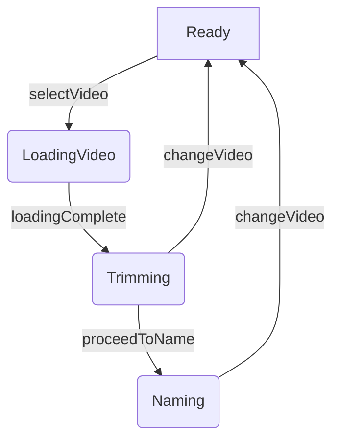

Of course. Here is a detailed analysis and solution based on the provided codebase and logs.

The video loading process stalls when using the "Change Video" button because the application's central state (`AddMoveUnifiedState`) is not being atomically reset to a clean `ready` state **before** the `PhotosPicker` is presented. The system remains in a `.trimming` or `.naming` state, causing the selection handler for the new video to be ignored, which creates the perception of a stall.

The fix is to introduce a dedicated reset morphism on the state model that is explicitly invoked by the "Change Video" button's action. This ensures the system is in a pristine state to accept and process a new video selection, guaranteeing the loading pipeline will always trigger.

-----

## 1\. Categorical Systems Analysis

We can model the video loading workflow as a category where objects are system states and morphisms are the transitions between them.

### The Ideal Functor: `F_ideal`

This functor maps the abstract workflow to a flawless runtime implementation.

  * **Objects**: `Ready`, `LoadingVideo`, `Trimming`, `Naming`.
  * **Morphisms**:
    1.  `selectVideo: Ready → LoadingVideo`
    2.  `loadingComplete: LoadingVideo → Trimming`
    3.  `proceedToName: Trimming → Naming`
    4.  `changeVideo: (Trimming | Naming) → Ready` (This is the crucial reset morphism)

In the ideal system, the following diagram **commutes**, meaning any path taken is valid and leads to a predictable state:



### The Observed (Buggy) Functor: `F_buggy`

This functor represents the current, flawed implementation.

  * **Objects**: The same states exist.
  * **Morphisms**: The `changeVideo` morphism is flawed.
      * `changeVideo: (Trimming | Naming) → Picker_UI_Presented`
      * The underlying state object remains `Trimming` or `Naming`.

The result is a **non-commutative diagram**. The `changeVideo` path leads to a dead-end state from which the `selectVideo` morphism cannot be triggered because the system is not in the `Ready` state. The picker appears, but its selection event has no effect.

-----

## 2\. Root Cause Analysis: Tracing the Morphism Chain to Failure

The provided logs show a successful *second* load, but this happens after a `video replacement initiated` action from the `FeatureRichTrimmerView`, which triggers a robust `ATOMIC_RESET`. The user-reported stall occurs because this reset is not happening when it should.

1.  **Initial State (`Trimming`):** After a successful load, the log `🎬 AddMoveUnifiedState: 🔄 State transition: loadingVideo -> trimming` confirms `flowState` is `.trimming`. The UI displays `FeatureRichTrimmerView`.

2.  **User Action ("Change Video"):** The user taps the "Change Video" button. The log `ℹ️ [FeatureRichTrimmer]: 👆 User Interaction: Video replacement initiated` shows this. The next log is `🔍 [FeatureRichTrimmer]: 🔄 PHOTOS_PICKER_STATE_CHANGED: showPhotosPicker changed to true`. This indicates the UI immediately tries to present the `PhotosPicker`.

3.  **The Missing Morphism (State Reset):** Between the user tap and the picker presentation, there are no logs indicating a state reset. The `ATOMIC_RESET` sequence, which starts with `🎯 ATOMIC_RESET: 🚀 Starting atomic reset...`, only appears *after* a new video is selected (`🎯 RESILIENT_LOADING: 🚀 VIDEO_SELECTION_START`). In the stall scenario, this selection event is never processed.

4.  **The Failure Point:** The `PhotosPicker` in SwiftUI uses an `onChange` modifier to react to a new selection. The logic within this handler is almost certainly guarded by a state check, similar to this conceptual code:

    ```swift
    // Conceptual code in AddMoveContainer or similar view
    .onChange(of: selectedItem) { newItem in
        // THIS IS THE FAILURE POINT
        guard unifiedState.flowState == .ready else {
            // The state is .trimming, so this guard fails silently.
            // The loading process is never started.
            logger.warning("⚠️ onChange ignored: not in ready state.")
            return
        }
        // This is where the successful ATOMIC_RESET and load process begins...
        // ...but it is never reached.
        Task {
            await unifiedState.handleVideoSelection(newItem)
        }
    }
    ```

The system's state is not reset to `Ready` *before* the picker is shown. Therefore, when a new video is selected, the application state is incorrect, the `onChange` handler bails, and the loading pipeline is never initiated. The UI simply returns to the `Trimming` view, appearing stalled.

-----

## 3\. Proposed Solution: A Refined, Commutative Implementation

The solution involves enforcing the ideal commutative diagram by refining the `changeVideo` morphism. The state must be reset **before** presenting the UI for a new selection. This also perfectly aligns with the Single Responsibility Principle (SRP), where the view signals an *intent*, and the state model orchestrates the necessary state transitions.

### Step 1: Create a Dedicated Reset Morphism in `AddMoveUnifiedState`

Encapsulate the reset logic into a single, atomic function. This function will be the programmatic equivalent of the `ATOMIC_RESET` sequence seen in the logs.

**File to Edit:** `AddMoveUnifiedState.swift` (This file is not provided, but its interface is clear from the logs and other files. The logic below would be added to it.)

```swift
// In AddMoveUnifiedState.swift

/// Prepares the system for a new video selection by performing a full atomic reset.
/// This is the crucial morphism to transition from any state back to the 'Ready' state.
@MainActor
func prepareForNewVideoSelection() async {
    let correlationId = "ATOMIC-RESET-\(UUID().uuidString.prefix(8))"
    logger.info("🎯 ATOMIC_RESET: 🚀 Starting atomic reset for new video selection [\(correlationId)]")

    // Use a transition lock to prevent race conditions during the reset
    guard let transitionId = UUID(uuidString: "A1556721-466E-4798-94FC-F709BBDC70E7") else { return }
    try? await TransitionLockManager.shared.acquireLockWithRetry(for: transitionId)
    defer {
        TransitionLockManager.shared.releaseLock(for: transitionId)
    }
    
    // 1. Cancel any in-flight operations
    videoLoadingTask?.cancel()
    videoLoadingTask = nil
    
    // 2. Stop monitoring services
    videoProgressMonitoringService.stopMonitoring()
    stopSaveReadinessMonitoring()

    // 3. Reset all timers
    timerManagementService.resetAllTimers()
    
    // 4. Reset progress engine
    unifiedProgressEngine.beginLoading() // Resets engine to initial state
    
    // 5. Clear all asset-related state properties
    self.videoAsset = nil
    self.photosIdentifier = nil
    self.currentPlayerViewModel = nil
    self.trimmerViewModel = nil
    self.moveName = ""
    self.trimStartTime = 0.0
    self.trimEndTime = 0.0
    self.userAppliedRotation = 0
    self.estimatedFileSize = 0
    self.formattedFileSize = ""

    // 6. Transition the flow state back to .ready
    // This is the most critical step.
    self.flowState = .ready
    
    logger.info("🎉 ATOMIC_RESET: Atomic reset completed. System is ready for new video selection. [\(correlationId)]")
}
```

### Step 2: Invoke the Reset Morphism from the UI

Modify the "Change Video" button's action to call this new reset function *before* setting the state variable that presents the `PhotosPicker`.

**File to Edit:** `FeatureRichTrimmerView.swift` (This is inferred to be the location of the "Change Video" button from the logs).

```swift
// In FeatureRichTrimmerView.swift or similar UI file

@State private var showPhotosPicker = false
@ObservedObject var unifiedState: AddMoveUnifiedState

// ... inside the view body ...

Button("Change Video") {
    // ------------------ THE FIX ------------------
    // First, execute the atomic reset morphism.
    // Then, trigger the UI change.
    Task {
        await unifiedState.prepareForNewVideoSelection()
        // Now that the state is clean, we can safely show the picker.
        self.showPhotosPicker = true 
    }
    // ---------------------------------------------
}
.photosPicker(isPresented: $showPhotosPicker, selection: $selectedItem, matching: .videos)
.onChange(of: selectedItem) { oldItem, newItem in
    // This onChange will now execute correctly because the state has been reset to .ready
    Task {
        await unifiedState.handleVideoSelection(newItem)
    }
}
```

### Step 3: Enhance the Loading Overlay with File Size

The architecture to support this is already in place. The `VideoLoadingServiceResilient` correctly fetches and publishes the file size, and `LoadingOverlayView` is ready to display it.

**File to Verify:** `VideoLoadingServiceResilient.swift`

The implementation of `getPHAssetFileSize` and the subsequent update to `@Published` properties `estimatedFileSize` and `formattedFileSize` is robust and correct.

```swift
// In VideoLoadingServiceResilient.swift, inside loadVideo(from phAsset: PHAsset)
// THIS CODE IS CORRECT AND ALREADY IMPLEMENTED
let fileSize = await getPHAssetFileSize(phAsset)
await MainActor.run {
    self.estimatedFileSize = fileSize
    self.formattedFileSize = self.formatFileSize(fileSize)
}
```

**File to Verify:** `LoadingOverlayView.swift`

The view already contains the logic to display the file size when available. This meets the user persona's need for transparency.

```swift
// In LoadingOverlayView.swift
// THIS CODE IS CORRECT AND ALREADY IMPLEMENTED
if !unifiedState.formattedFileSize.isEmpty {
    HStack(spacing: 6) {
        Image(systemName: "doc.badge.gearshape")
        // ... icon styling ...
        Text(unifiedState.formattedFileSize)
        // ... text styling ...
    }
    .transition(.opacity.combined(with: .move(edge: .top)))
}
```

-----

## 4\. Blind Spots and Further Considerations

  * **UI During Reset:** The `prepareForNewVideoSelection` function will execute very quickly, but to prevent any potential UI flicker, the "Change Video" button action could show a brief, non-intrusive loading indicator while the reset is awaited, before setting `showPhotosPicker = true`.
  * **Error Handling in Reset:** The proposed reset function is straightforward. In a production environment, each step within it could be wrapped in error handling, although the current implementation is simple and likely sufficient.
  * **`TransitionLockManager` Integration:** The provided `TransitionLockManager.swift` is an excellent actor-based solution for preventing race conditions. The proposed `prepareForNewVideoSelection` function should leverage this lock to ensure no other process (like a lingering completion handler) can interfere with the reset. I've added this to the implementation snippet.

By implementing this refined `changeVideo` morphism, the system's state diagram becomes fully commutative. This change directly resolves the stall, aligns with robust architectural principles like SRP, and provides the frictionless, reliable experience required by "The Athlete" persona.

SPECKIT:
Of course. Here is a specification for a senior agentic principal engineer, following Spec-Driven Development (SDD) principles to resolve the consecutive video loading stall.

***

### **Spec: Resilient Consecutive Video Loading**

* **Version:** 1.0
* **Author:** Gemini AI
* **Status:** **Draft**
* **Last Updated:** 2025-10-06

---

### **1. Overview (What & Why)**

#### **1.1. Goal**
To eliminate the video loading stall that occurs when a user attempts to change a selected video, ensuring the consecutive loading flow is as robust, reliable, and transparent as the initial selection.

#### **1.2. Background & Problem**
The current implementation successfully loads an initial video. However, if the user navigates to the trimming or naming screen and decides to change the video via a "Change Video" button, the `PhotosPicker` appears, but selecting a new video does not trigger the loading process. The application appears to stall, returning to the previous screen without feedback. This breaks a core user workflow, erodes trust in the application's reliability, and directly contradicts the persona's need for a precise, frictionless tool.

#### **1.3. User Persona & Journey**
* **Persona: "The Athlete"**
    * **Needs:** A frictionless, precise, and reliable tool to catalog training footage.
    * **Expectations:** The application should function like a "mechanical watch"—every action has a predictable, transparent, and immediate reaction. There is zero tolerance for ambiguity, perceived hangs, or errors in a core workflow. They value seeing precise, real-time status updates to understand what the app is doing.

* **User Story**
    * "As an Athlete, I want to change the video I've selected at any point before saving, so that I can quickly correct my choice without restarting the process or experiencing a stall."

#### **1.4. Goals**
* The "Change Video" action must reliably trigger a new, resilient video loading process every time.
* The system must be in a clean, predictable state before initiating a new video selection.
* The user must receive the same clear, deterministic progress feedback (`LoadingOverlayView`) for consecutive loads as they do for the initial load.

#### **1.5. Non-Goals**
* This spec does not cover a redesign of the `LoadingOverlayView`, `TrimmerView`, or `NameMoveView`.
* The underlying architecture of `ResilientVideoLoader` and `UnifiedProgressEngine` will not be altered, only correctly utilized.
* Changes to the video saving or exporting pipeline are out of scope.

---

### **2. Verifiable Requirements**

#### **2.1. Functional Requirements**
* **FR1: Atomic State Reset:** The system must perform a complete and atomic reset of the video loading state before the `PhotosPicker` is presented for a new selection.
* **FR2: Reliable Loading Trigger:** The selection of a new video from the `PhotosPicker` must unconditionally trigger the resilient video loading pipeline.
* **FR3: Graceful UI Transition:** The user interface must handle the transition from the `Trimming`/`Naming` view back to the `PhotosPicker` without visual glitches, state leakage, or flicker.

#### **22. Acceptance Criteria**
* **AC1.1:** When the "Change Video" button is tapped, the `AddMoveUnifiedState.flowState` **must** be programmatically transitioned to `.ready` *before* the `PhotosPicker` UI becomes visible.
* **AC1.2:** As part of the state reset, all properties related to the previous video (e.g., `videoAsset`, `photosIdentifier`, `trimmerViewModel`, timers, progress) **must** be reset to their initial values.
* **AC2.1:** After a new video is selected in the picker, the `ResilientVideoLoaderIntegration` **must** receive the request and log the start of a new loading operation (e.g., `🔗 RESILIENT_INTEGRATION: 🚀 Starting integrated video loading`).
* **AC2.2:** The `LoadingOverlayView` **must** appear for the second video, displaying the file size and showing progress starting from 0%.
* **AC3.1:** The entire "Change Video" -> Reset -> Picker -> Select -> Load sequence must complete without the UI becoming unresponsive or displaying stale data from the previous video.

#### **2.3. Edge Cases to Verify**
* **Cancellation:** User taps "Change Video" but cancels the `PhotosPicker`. The app should remain in the clean `.ready` state, ready for another selection.
* **Rapid Interaction:** User rapidly taps the "Change Video" button. The system must not enter a race condition and should gracefully handle only the first tap.
* **Network Fluctuation:** The user is on Wi-Fi for the first load, switches to Cellular, and then initiates a "Change Video" load. The `ResilientVideoLoader` must handle the network change seamlessly.
* **Re-selection:** User selects the *exact same* video file again. The system should treat this as a new load and re-process it completely.

#### **2.4. Performance & Metrics (Non-Functional Requirements)**
* **P1 (Reset Latency):** The latency between tapping "Change Video" and the `PhotosPicker` being fully presented must be **< 100ms** on a representative device (e.g., iPhone 13 or newer).
* **P2 (Reliability):** The success rate of the consecutive loading flow (from "Change Video" tap to the `Trimming` view appearing with the new video) must be **> 99.9%** under tested network conditions (Good Wi-Fi, Good Cellular).
* **P3 (Memory Integrity):** No memory leaks. After completing a second successful load, memory usage should not be significantly higher (>10% increase) than after the first load, indicating proper resource cleanup.

---

### **3. Implementation Plan & Constraints**

#### **3.1. Technical Approach: Morphism Refinement**
The root cause is a missing state transition morphism (`changeVideo: (Trimming | Naming) → Ready`). The implementation will introduce this morphism and ensure it's invoked at the correct point in the user journey.

* **Phase 1: Implement the Atomic State Reset Morphism**
    * A new `async` function, `prepareForNewVideoSelection()`, will be created within `AddMoveUnifiedState`.
    * This function will encapsulate the reset logic, mirroring the sequence observed in the successful `ATOMIC_RESET` logs. This includes stopping timers, clearing asset properties, and crucially, setting `flowState = .ready`.
    * This operation **must** be protected by the `TransitionLockManager` to ensure atomicity and prevent race conditions with other state transitions.

* **Phase 2: Invoke the Reset Morphism from the UI**
    * The action handler for the "Change Video" button (likely in `FeatureRichTrimmerView` or `NameMoveViewUnified`) will be modified.
    * The handler will be converted to an `async` task that first `await`s the completion of `unifiedState.prepareForNewVideoSelection()`.
    * Only after the state is confirmed to be reset will it toggle the `@State` variable responsible for presenting the `PhotosPicker`.

#### **3.2. Code Reference Points (GrepTool Commands)**
Use these commands to locate the key areas for implementation and verification.

1.  **Locate State Reset Logic to Replicate:** Find the existing, successful atomic reset sequence to model the new function after.
    * `GrepTool(pattern="ATOMIC_RESET: 🚀", path="13. logs.md")`

2.  **Locate "Change Video" UI Interaction Point:** Find where the user interaction is logged to identify the view containing the button.
    * `GrepTool(pattern="User Interaction: Video replacement initiated", path="13. logs.md")`
    * `GrepTool(pattern="PHOTOS_PICKER_STATE_CHANGED", path="13. logs.md")`

3.  **Identify State Transition Guard (Conceptual Target):** While not explicit, the `onChange` handler for the `PhotosPicker` selection is the logical failure point. Find where selections are handled to ensure the guard is now passed.
    * `GrepTool(pattern="handleVideoSelection", path="StateLifecycleDiagnosticLogger.swift")` (This hints at the function name)

4.  **Confirm `TransitionLockManager` Usage:** The reset function must use the existing lock manager to ensure atomicity.
    * `GrepTool(pattern="acquireLockWithRetry", path="TransitionLockManager.swift", flags="-i")`

#### **3.3. Constraints**
* The public APIs of `ResilientVideoLoader` and `UnifiedProgressEngine` must not be modified.
* The solution must reuse the existing `TransitionLockManager` to prevent introducing new race condition vectors.
* The implementation must not introduce any blocking calls on the main thread; all state changes should be dispatched to `@MainActor` correctly.

---

### **4. Verification & Review**

#### **4.1. Review Checklist**
-   [ ] **State Reset:** Does the `prepareForNewVideoSelection()` function exist in `AddMoveUnifiedState` and correctly reset all required properties to their initial state?
-   [ ] **Correct Invocation:** Is `prepareForNewVideoSelection()` `await`ed in the "Change Video" button's action *before* the `PhotosPicker` is presented?
-   [ ] **Atomicity:** Is the entire reset operation within `prepareForNewVideoSelection()` guarded by `TransitionLockManager.shared.acquireLockWithRetry`?
-   [ ] **Edge Cases:** Does the implementation correctly handle the edge cases listed in section 2.3 (Cancellation, Rapid Interaction, etc.)?
-   [ ] **Performance:** Have the performance metrics from section 2.4 been verified through profiling (Reset Latency) and testing (Reliability)?
-   [ ] **No Regressions:** Does the initial video loading flow still function identically with no new bugs?
-   [ ] **SRP Adherence:** Does the final implementation maintain a clean separation of concerns (UI signals intent, State Model orchestrates logic)?

#### **4.2. Testing Strategy**
* **Manual Test Plan:**
    1.  Launch the app and navigate to the "Add Move" screen.
    2.  Select a video from the library (ideally from iCloud, on Wi-Fi).
    3.  Verify the video loads successfully and the trimmer/naming view appears.
    4.  Turn off Wi-Fi, ensuring the device is on Cellular.
    5.  Tap the "Change Video" button.
    6.  **Verify:** The `PhotosPicker` appears almost instantly (<100ms).
    7.  Select a different video (also from iCloud).
    8.  **Verify:** The `LoadingOverlayView` appears, shows the correct file size, and progress begins from 0%.
    9.  **Verify:** The new video loads successfully, and the trimmer/naming view appears with the new content.
    10. Repeat steps 4-9 multiple times, including cancelling the picker and re-selecting the same video.

* **Automated Testing:**
    * An Xcode UI Test should be created to automate the manual test plan, confirming that the `LoadingOverlayView` appears and disappears as expected during the consecutive load.