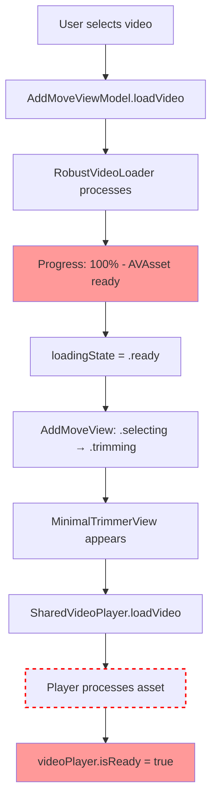
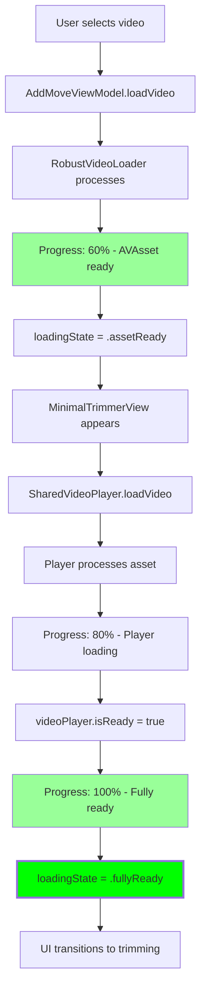

# Video Loading Synchronization Design

## Architecture Overview

### Current State Issues



**Problem:** UI shows ready at step D, but video isn't actually playable until step J.

### Proposed Solution Architecture



## State Management Design

### Enhanced LoadingState Enum

```swift
public enum LoadingState: Equatable {
    case idle
    case loading(progress: Double, stage: LoadingStage)
    case assetReady(AVAsset)           // AVAsset loaded, player loading pending
    case playerReady(AVAsset)          // Player ready, finalizing
    case fullyReady(AVAsset)           // Both asset and player ready
    case failed(String)
}

public enum LoadingStage: Equatable {
    case initializing              // 0-10%
    case downloadingAsset         // 10-40%
    case processingAsset          // 40-60%
    case initializingPlayer       // 60-80%
    case preparingPlayback        // 80-95%
    case finalizing               // 95-100%
}
```

### Coordinated Progress Calculation

```swift
// In AddMoveViewModel
private func calculateOverallProgress() -> Double {
    switch loadingState {
    case .loading(let progress, let stage):
        return stage.baseProgress + (progress * stage.weight)
    case .assetReady:
        return 0.6  // 60% - Asset loaded
    case .playerReady:
        return 0.8  // 80% - Player ready
    case .fullyReady:
        return 1.0  // 100% - Fully ready
    default:
        return 0.0
    }
}
```

### Synchronized Player Integration

```swift
// Enhanced SharedVideoPlayer with ready callbacks
public func loadVideo(_ asset: AVAsset, onReady: @escaping () -> Void) async {
    // ... existing loading logic ...

    // Call ready callback when player becomes ready
    if playerItem.status == .readyToPlay {
        onReady()
    }
}
```

## Implementation Strategy

### Phase 1: Enhanced State Tracking
1. Extend `LoadingState` enum with intermediate states
2. Update `AddMoveViewModel` to track loading stages
3. Modify progress calculation to reflect actual readiness

### Phase 2: Player Integration
1. Add ready-state callbacks to `SharedVideoPlayer.loadVideo`
2. Update `MinimalTrimmerView` to coordinate with player readiness
3. Implement synchronized loading overlay logic

### Phase 3: UI Synchronization
1. Update loading overlay to show accurate progress
2. Ensure smooth transitions between loading states
3. Add diagnostic logging for debugging

## Error Handling & Recovery

### Enhanced Error Scenarios
- **Asset Loading Failure**: Revert to selection state with clear error message
- **Player Initialization Failure**: Attempt recovery or provide alternative loading method
- **Timeout Scenarios**: Graceful fallback with user guidance

### Recovery Mechanisms
```swift
private func handlePlayerLoadingFailure() {
    // Attempt to reload player with same asset
    // If failed again, provide clear error message
    // Allow user to retry or select different video
}
```

## Performance Considerations

### Optimizations
- **Lazy Loading**: Only initialize player when transitioning to trimming view
- **Resource Cleanup**: Proper cleanup of failed loading attempts
- **Memory Management**: Efficient handling of large video assets

### Monitoring
- **State Transition Logging**: Comprehensive logging for debugging
- **Performance Metrics**: Track loading times and identify bottlenecks
- **User Experience Metrics**: Monitor success rates and loading times

## Testing Strategy

### Unit Tests
- LoadingState enum behavior
- Progress calculation accuracy
- State transition logic

### Integration Tests
- AddMoveViewModel → SharedVideoPlayer coordination
- UI state synchronization
- Error recovery scenarios

### UI Tests
- Loading overlay behavior
- Smooth transitions between states
- User interaction during loading

## Migration Path

### Backward Compatibility
- Maintain existing API contracts
- Add new states without breaking current functionality
- Gradual migration path for dependent components

### Rollback Strategy
- Feature flags for controlled rollout
- Quick revert capability if issues arise
- Monitoring and alerting for regression detection